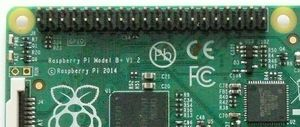
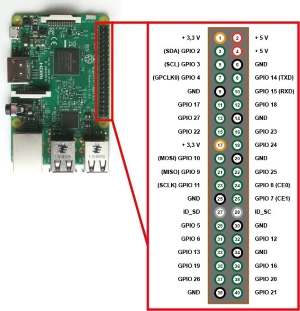
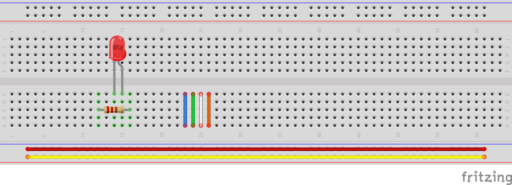
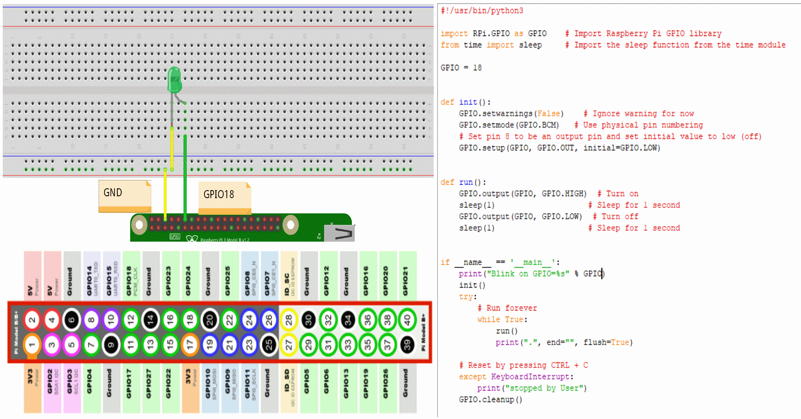
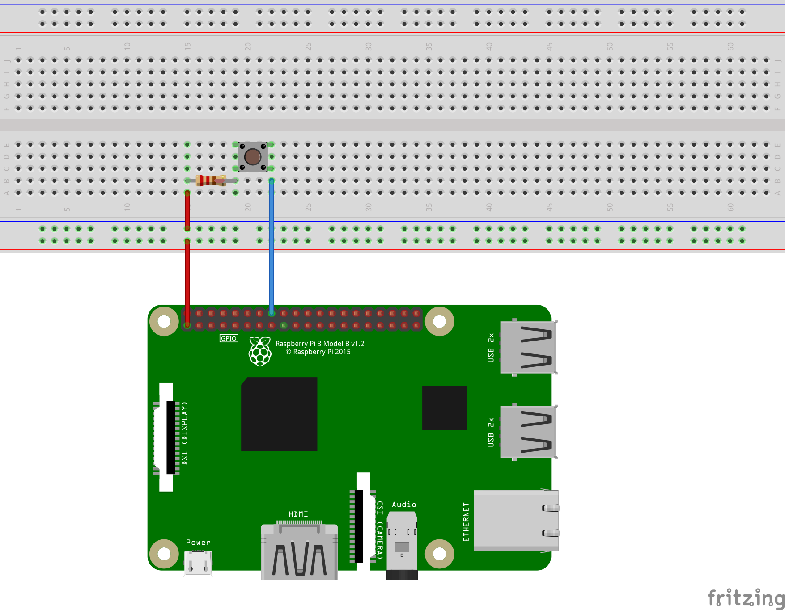
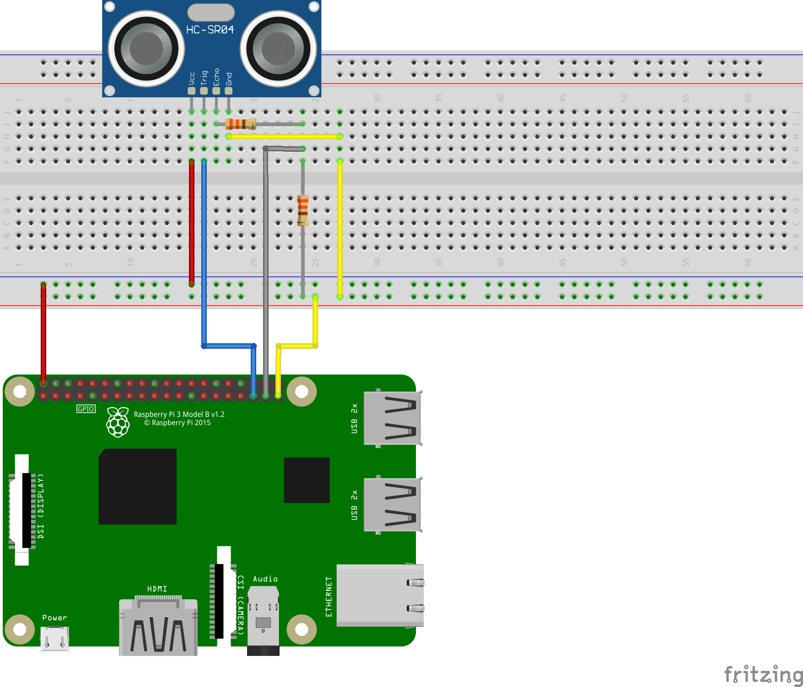
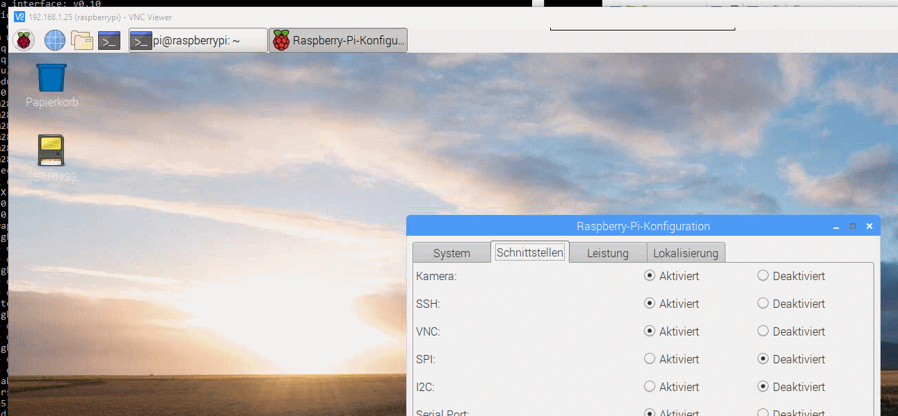

<!-- $theme: default -->

<!-- $size: 16:9 -->


_Vorlesung zur Veranstaltung [Bachelorstudiengang Informatik](https://www.th-rosenheim.de/technik/informatik-mathematik/informatik-bachelor/) an der [Hochschule Rosenheim](http://www.th-rosenheim.de)._

<div style="margin-top: 20%"></div>

# Internet of Things (IoT)


	Topic: **Raspberry Pi**


<div style="margin-top: 10%"></div>


**Dr. Marcel Tilly**

Fakultät Informatik


---
<!-- page_number: true -->
<!-- footer: Internet of Things (IoT), Fakultät Informatik, TH Rosenheim -->

# Der Raspberry Pi (RPi)

- Der Raspberry Pi ist ein Einplatinencomputer, der von der britischen Raspberry Pi Foundation entwickelt wurde
- Der Rechner enthält ein Ein-Chip-System (System on Chip, SoC) von Broadcom mit einem ARM-Mikroprozessor
	- CPU: ARM11
	- GPU: Broadcom Dual Core VideoCore IV (Full HD)
- Der Raspberry Pi kam Anfang 2012 auf den Markt
- Bis Ende 2017 wurden mehr als 17 Millionen Geräte verkauft


---
# Remote Desktop Connection
Diverse Windowmanager, XServer und Remote Desktop Programme (RDP) stehen für den Raspberry Pi bereit.

1. X.Org-Server
```
$ sudo apt-get update
$ sudo apt-get upgrade
$ sudo apt-get install xserver-xorg
$ sudo apt-get install xinit
```
2. Remote Desktop Verbindung über XRDP oder VNC (via [VNC Client](https://www.realvnc.com))
```
$ sudo apt-get install xrdp
$ sudo raspi-config
-> 5 Interfacing Options
-> P3 VNC         Enable/Disable graphical remote access to your Pi using RealVNC
```

---

# Schnittstellen

- **GPIO** (General Purpose Input/Output): Programmierbare Ein- und Ausgänge für allgemeine Zwecke
- Grundsätzlich: Der Raspberry Pi wird mit 5 Volt gespeist
- **Aber** arbeitet der _System on Chip_ auf Basis von 3,3 Volt
- Auch die GPIOs arbeiten mit 3,3 Volt (sowohl eingangs- als auch ausgangsseitig)
- **Anlegen von 5 V an GPIOs kann den RPi zerstören!**



---

# GPIO Belegung

Besonders hiflreich könnte die GPIO Bezeichnung (BCM) und Nummerierung (BOARD) sein

   
   

**ACHTUNG**: Es gibt 2 Nummerierungen GPIO-NUmmer (BCM=Broadcom Pin Number) und die Boardnummer
   
---

# GPIO Zustände

- GPIO hat nicht zwangsläufig einen festgelegten Zustand (_High_ oder _Low_)
- GPIO-Eingänge sind CMOS-Eingänge mit Tendenz im unbeschalteten Zustand _High_ anzunehme
- Zustand ist aber zufällig und hängt ab von
	-  hochfrequenten Einstreuungen umliegender Bauteile und Pins
	-  Überspannung
- **Trick**: Man verhilft dem GPIO-Eingang zu einem definierten Grundzustand
- In der Praxis versieht man den jeweiligen Pin mit einem Pullup- oder Pulldown-Widerstand
	- Abhängig davon, ob man als Grundzustand "High" oder "Low" erwartet
	- GPIO wird auf einen bestimmten Pegel (Spannungswert) "gezogen" (engl. _pull_)
	- Pullup bedeutet auf "High" rauf- und Pulldown auf "Low" runterziehen.

---

# GPIO mit Pullup-Widerstandschaltung (1/2)

- Ein Widerstand ist von _+VCC_ auf einen GPIO-Eingang geschaltet und der geöffnete Schalter vom GPIO-Eingang auf GND.
- Pullup-Widerstand und Schalter ist wie Reihenschaltung aus zwei Widerständen


---

# GPIO mit Pullup-Widerstandschaltung (2/2)


- Schalter offen
	- Bei offenem Schalter zieht der Widerstand den GPIO-Eingang gegen +VCC. Hier liegen definitiv z. B. +3,3 V, also "high", an. Und deshalb wird dieser Widerstand Pullup-Widerstand genannt.
- Schalter geschlossen
	- Wird der Schalter betätigt, dann wird der GND mit dem GPIO-Eingang verbunden. Das hat folgenden Effekt: Die Spannung fällt komplett am Pullup-Widerstand ab und dadurch liegt am GPIO-Eingang _GND_ an und somit ein "low"

---

# GPIO mit Pulldown-Widerstandschaltung (1/2)

- Der geöffnete Schalter wird von +VCC auf den GPIO-Eingang geschaltet und der Widerstand vom GPIO-Eingang auf _GND_.
- Pulldown-Widerstand und Schalter kann man sich auch als Reihenschaltung aus zwei Widerständen vorstellen


---

# GPIO mit Pulldown-Widerstandschaltung (2/2)

- Schalter offen
	- Bei offenem Schalter zieht der Widerstand den GPIO-Eingang gegen GND. Hier liegt definitiv 0 V, also "low", an. Und deshalb wird dieser Widerstand als Pulldown-Widerstand bezeichnet. Weil der Widerstand den GPIO auf 0 V runterzieht.
- Schalter geschlossen
	- Wird der Schalter betätigt, dann wird +VCC direkt an den GPIO-Eingang gelegt. Das hat folgenden Effekt: Die Spannung fällt komplett am Pulldown-Widerstand ab und dadurch liegt am GPIO-Eingang +VCC an und somit ein "high".
---

# GPIO mit 'sysfs' steuern

- GPIOs werden auf dem Raspberry Pi als Dateien repräsentiert und befinden sich unter "/sys/class/gpio"
- Man bezeichnet das als "sysfs"

```
ls /sys/class/gpio
```

- Bei der Steuerung und Programmierung muss man darauf achten, dass man nicht die Pin-Nummer wählt, sondern die BCM-Nummer des GPIOs.
- Programmierung/Steuern kann hier über die Shell/Bash erfolgen
- Nachteil: Erfordert Root-Rechte (sudo) ... Alternative **pigpio**

---
<!-- *footer:  -->

# GPIO via sysfs (Shell/Bash)

Erzeugen des GPIO
```
echo 15 > /sys/class/gpio/export
```

Richtung festlegen (_in_ oder _out_)
```
echo "out" > /sys/class/gpio/gpio15/direction
```
Zustand setzen (_high_)
```
echo "1" > /sys/class/gpio/gpio15/value
```
Zustand setzen (_high_)
```
echo "0" > /sys/class/gpio/gpio15/value
```

GPIO deaktivieren
```
echo 15 > /sys/class/gpio/unexport
```

---

# GPIO via **pigpio** (Shell/Bash)

Installation und Einrichten
```bash
sudo apt-get install pigpio
sudo systemctl start pigpiod	# pigpio-Deamon starten
sudo systemctl enable pigpiod   # pigpio-Deamon auch beim Systemstart mitstarten
```

Pin als Ausgang konfigurieren (_w= write_ und _r=read_)
```
pigs modes 17 w
```
Zustand setzen (_0=low_ und _1=high_)
```
pigs w 17 0
```
Zustand lesen
```
pigs r 17
```

---

# Alternativen zu Shell/Bash Programmierung

- C/C++ : [wiringPI](http://wiringpi.com/)
- Java: [Pi4J Projekt](https://pi4j.com/1.2/index.html)
- **Python: RPi.GPIO**, gpiozero, 
- ...

---

# Installation von Bibliotheken

Für die Aufgaben wird Python und ein paar Python Libraries auf dem RPi und dem Rechner verwendet.

Für MQTT (swowohl auf dem RPi, als auc auf dem Rechner) installieren:

- auf dem RPi:

```
pip3 install paho-mqtt
```

- auf dem PC:

```
pip install paho-mqtt
```

Für die RPi GPIO Interaktionen benötigeen Sie das **RPI.GPIO** Package: 

```
pip3 install RPi.GPIO
```
---

# Ein Wort über: _Breadboards_

- Breadboards sind eines der grundlegendsten Elemente, wenn Sie lernen, wie man Schaltungen baut
- Breadboards sind Prototype-Boards
- **Historisch**: Vor vielen Jahren, als die Elektronik groß und sperrig war, schnappten sich die Leute das Breadboard (Brettchen) ihrer Mutter, ein paar Nägel oder Reißzwecke und begannen, Drähte an das Board anzuschließen, um sich selbst eine Plattform zu geben, auf der sie ihre Schaltungen aufbauen konnten. 



---

# Beispiel 1: LED via Python an GPIO 18 (Code: [blink.py](./blink.py))



---

# Beispiel 2: Button Input (1/2)



---

# Beispiel 2: Button Input (2/2) (Code: [button.py](./button.py))

```python
#!/usr/bin/python3

import RPi.GPIO as GPIO

PIN = 12

def button_down(channel):
    print("button pressed")

if __name__ == '__main__':
    GPIO.setwarnings(True)  	# Ignore warning for now
    GPIO.setmode(GPIO.BOARD) 	# Use physical pin numbering
    # Set pin to be an input pin and set initial value to be pulled low (off)
    GPIO.setup(PIN, GPIO.IN, pull_up_down=GPIO.PUD_DOWN)

    GPIO.add_event_detect(PIN, GPIO.RISING, callback=button_down)

    message = input("Press enter to quit\n\n")

    GPIO.cleanup()

```

---

# Beispiel 3: Ultrasonic Sensor (1/3)



---

# Beispiel 3: Ultrasonic Sensor (2/3) ([usonic_distance.py](./usonic_distance.py))

```python
import RPi.GPIO as GPIO
import time

# set GPIO Pins
GPIO_TRIGGER = 19
GPIO_ECHO = 26
# set GPIO direction (IN / OUT)
GPIO.setmode(GPIO.BCM)
GPIO.setup(GPIO_TRIGGER, GPIO.OUT)
GPIO.setup(GPIO_ECHO, GPIO.IN)

def distance(): ...

if __name__ == '__main__':
    print("Distance measure started!")
    while True:
         dist = distance()
         print("Measured Distance = %.1f cm" % dist)
         time.sleep(1)
    GPIO.cleanup()
```

---

# Beispiel 3: Ultrasonic Sensor (3/3) ([usonic_distance.py](./usonic_distance.py))

```python
...
def distance():
    # set Trigger to HIGH
    GPIO.output(GPIO_TRIGGER, True)
    # set Trigger after 0.01ms to LOW
    time.sleep(0.00001)
    GPIO.output(GPIO_TRIGGER, False)

    StartTime = time.time()
    StopTime = time.time()
    # save StartTime
    while GPIO.input(GPIO_ECHO) == 0:
        StartTime = time.time()
    # save time of arrival
    while GPIO.input(GPIO_ECHO) == 1:
        StopTime = time.time()
    # time difference between start and arrival
    TimeElapsed = StopTime - StartTime
    # multiply with the sonic speed (34300 cm/s)
    # and divide by 2, because there and back
    distance = (TimeElapsed * 34300) / 2
    return distance
...
```
---

# Camera mit RPi
- Prinzipiell 2 Optionen:
	- Picocam mit picamera
	- Web Cam mit OpenCV: installtion von OpenCv auf RPi ist etwas tricky
---

# Picamera

Einfach Cam verdinden und sicherstellen, dass _Kamera_ aktiviert ist



 ```Python
 from picamera import PiCamera
from time import sleep

camera = PiCamera()

camera.start_preview()
sleep(10)
camera.stop_preview()
 ```
 
---

# WebCam mit openCV

- openCV installieren
```
$ sudo apt-get install libhdf5-dev libhdf5-serial-dev libhdf5-100
$ sudo apt-get install libqtgui4 libqtwebkit4 libqt4-test python3-pyqt5
$ sudo apt-get install libatlas-base-dev
$ sudo apt-get install libjasper-dev
pip3 install opencv-contrib-python
```
- Stelle sicher, dass die WebCam erkannt wird
```
dmesg|less
...
 usbcore: registered new interface driver uvcvideo
 USB Video Class driver (1.1.1)
...
ls /dev/vi*

/dev/video0
```

---

# WebCam Zugriff via Python 


```Python
import cv2

def show_webcam(mirror=False):
    cam = cv2.VideoCapture(0)
    while True:
        ret_val, img = cam.read()
        if mirror:
            img = cv2.flip(img, 1)
        cv2.imshow('my webcam', img)
        if cv2.waitKey(1) == 27:
            break  # esc to quit
    cv2.destroyAllWindows()


if __name__ == '__main__':
    show_webcam(mirror=True)
```

